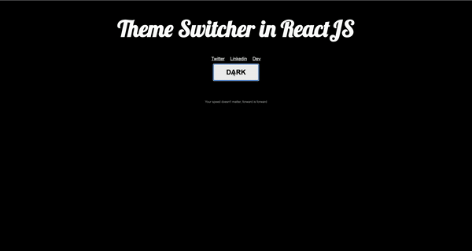

# Theme Switcher in ReactJS

This is working example of theme switcher in ReactJS by using **Context API Hook** and **CSS Variables**.

;

## Files Strcuture

`/components`: For all reusable components

`/pages`: For pages

## Walkthrough

`/components/Context.js` : This file has the both the context and the provider for the theme.

`assets/style/style.css`: CSS Variables for the theme

## How to use?

- Download or clone the repo

- run `npm install`

- run `npm start`

- Go to your localhost

### :star: Do you have something to add or improve? Don't hesitate to do contribution. :star:

### :heart: You can follow me at [Dev](https://dev.to/hellonehha), [Twitter](https://twitter.com/hellonehha), [Linkedin](https://www.linkedin.com/in/nehha/) :heart:
